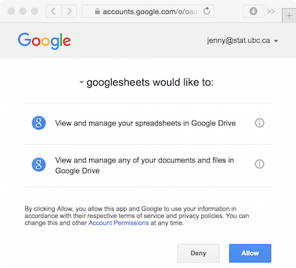
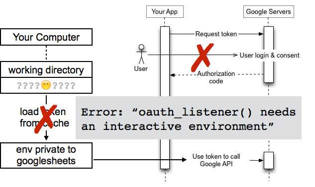
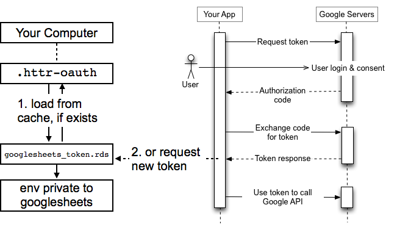
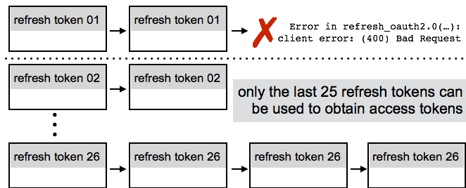

# Managing OAuth Tokens
Jenny Bryan  
`r Sys.Date()`  


## Who should read this

This vignette explains Google auth token management for anyone who wants to use `googlesheets` in code that runs non-interactively. Examples:

  * [R markdown](http://rmarkdown.rstudio.com) document
  * Cron job
  * Unattended script on a server
  * Automated unit tests, e.g. [`testthat`](http://r-pkgs.had.co.nz/tests.html)
  * Hosted continuous integration, e.g. [Travis CI](https://travis-ci.org)
  
Since `googlesheets` gets its authorization functionality from [`httr`](https://cran.r-project.org/web/packages/httr/index.html), some of the content here may be relevant to other API-wrapping R packages that use `httr`.

## How to completely avoid reading this document

Which Google Sheets activities require authorization? And which do not?

Reading from a Sheet that is "published to the web" does not require authorization, if and only if you identify the Sheet via key or URL:


```r
library(googlesheets)
library(magrittr)
gs_gap_key() %>%
  gs_key(lookup = FALSE) %>% 
  gs_read() %>% 
  head(3)
#> Authorization will not be used.
#> Worksheets feed constructed with public visibility
#> Accessing worksheet titled "Africa"
#> Source: local data frame [3 x 6]
#> 
#>   country continent  year lifeExp      pop gdpPercap
#>     (chr)     (chr) (int)   (dbl)    (int)     (dbl)
#> 1 Algeria    Africa  1952  43.077  9279525  2449.008
#> 2 Algeria    Africa  1957  45.685 10270856  3013.976
#> 3 Algeria    Africa  1962  48.303 11000948  2550.817
```

On the other hand, if you identify a Sheet by its name, `googlesheets` will require authorization, because we must list of all your Sheets on Google Drive in order to look up the Sheet's key. This will be true even if the Sheet you seek is "published to the web". It's the key look up that requires auth, not reading the Sheet.

Implication: if your non-interactive `googlesheets` code only needs to read a published Sheet, you can eliminate the need for authorization by using Sheet key for access, as in the above example. And you can stop reading this now!

Of course, many other activities do require authorization. For example, creating a new Sheet:
  

```r
iris_ss <- gs_new("iris_bit", input = head(iris, 3), trim = TRUE, verbose = FALSE)
iris_ss %>% 
  gs_read()
#> Accessing worksheet titled "Sheet1"
#> Source: local data frame [3 x 5]
#> 
#>   Sepal.Length Sepal.Width Petal.Length Petal.Width Species
#>          (dbl)       (dbl)        (dbl)       (dbl)   (chr)
#> 1          5.1         3.5          1.4         0.2  setosa
#> 2          4.9         3.0          1.4         0.2  setosa
#> 3          4.7         3.2          1.3         0.2  setosa
```


## Where do tokens come from? The OAuth 2.0 flow

`googlesheets` uses [Google's OAuth 2.0 flow for Installed Applications](https://developers.google.com/identity/protocols/OAuth2#installed) to work with the Drive and Sheets APIs.


The `googlesheets` package plays the role of "Your App" in this figure and you are the User.

The first time you do something that requires authorization, `googlesheets` must request a **token** on your behalf. You can also trigger this manually with `gs_auth()`. You, the user, will be taken to the browser for "User login & consent":



This is where you *authenticate* yourself, so that `googlesheets` can subsequently place *authorized* requests on your behalf.

Behind the scenes, `googlesheets` uses `httr::oauth2.0_token()` (and ultimately `httr::init_oauth2.0()`) to complete the "authorization code, exchange code for token, token response" ping pong and store a **token**. This token is stored in an environment within `googlesheets` and is attached to subsequent API requests as necessary.

You can use `gs_user()` to see there is currently a valid token in force, who the associated Google user is, etc.:


```r
gs_user()
#>           displayName: google sheets
#>          emailAddress: gspreadr@gmail.com
#>                  date: 2015-10-10 23:03:07 GMT
#>          access token: valid
#>  peek at access token: ya29....aH5WE
#> peek at refresh token: 1/zNh...ATCKT
```

## Where do tokens live in between R sessions?

By default, when `googlesheets` gets a token for you, it's stored in memory for use in the current R session AND it's cached to a file named `.httr-oauth` in current working directory. This caching behavior comes from `httr`.


Note: If you use RStudio, the file browser hides most dotfiles, including `.httr-oauth`. From R itself, you can use `list.files(all.files = TRUE)` to get a list of files in current working directory, including dotfiles. It's a good idea to inform yourself about the presence/absence/location of `.httr-oauth`, especially if you're having trouble with non-interactive authorization.

In subsequent R sessions, at the first need for authorization, `googlesheets` looks for a cached token in `.httr-oauth` before initiating the entire OAuth 2.0 flow. Many APIs limit the number of active tokens per account, so it's better to refresh existing tokens than to request completely new ones. More on refreshing later.


#### Another chance to stop reading this document

If your usage is pretty simple, you may only need to make sure that the token cached in `.httr-oauth` is the one you want (e.g., associated with the correct Google user) and make sure this file lives alongside your R script or R Markdown file. If you are relying on automatic loading from cache in `.httr-oauth`, this error message is **highly suggestive** of a mis-specified path, i.e. that `httr-oauth` cannot be found at runtime: "oauth_listener() needs an interactive environment".



Here is a workflow that is doomed to fail:

  * You write an R script `/path/to/directoryA/foo.R` or an R Markdown document `/path/to/directoryA/foo.Rmd`.
  * You develop and test it interactively with working directory set to an *entirely different directory*, such as `/path/to/directoryB/`.
  * Your Google token is therefore cached to `/path/to/directoryB/.httr-oauth`.
  * You run `foo.R` or render `foo.Rmd` and get an error. Why? Because `.httr-oauth` is not in working directory at runtime.
  
You must make sure that `.httr-oauth` will be found in working directory when your script runs or your `.Rmd` is rendered.  
  
## Don't publish your tokens

Tokens, stored in `.httr-oauth` or elsewhere, grant whoever's got them the power to deal on your behalf with an API, in our case Sheets and Drive. So protect them as you would your username and password. In particular, if you're using a version control system, you should exclude files that contain tokens. For example, you want to list `.httr-oauth` in your `.gitignore` file.

## How do I store and retrieve a token?

In `googlesheets`, we've built some functionality into `gs_auth()` so the user can retrieve the current token for explicit storage to file and can load such a stored token from file. To be clear, most users should just enjoy the automagic token management offered by `httr` and the `.httr-oauth` cache file. But for non-interactive work and testing/developing `googlesheets` itself, we found it helpful to take more control.

Store a token from an interactive session:


```r
library(googlesheets)
token <- gs_auth()
saveRDS(token, file = "googlesheets_token.rds")
```



Things to think about:

  * Is there an existing `.httr-oauth` file in working directory? If so, the token will come from there! If that's not what you want, force the creation of a fresh token with `gs_auth(new_user = TRUE)`.
  * Do you want to provide your own app key and secret? Use arguments `key` and `secret` to specify that. If that's a global preference for all your `googlesheets` work, see the docs for `gs_auth()` for lines to put in `.Rprofile`.
  * Do you want this token to be cached to `.httr-oauth` in current working directory? Specify `cache = FALSE` to prevent that. If that's a global preference for all your `googlesheets` work, see the docs for `gs_auth()` for lines to put in `.Rprofile`.
  * Do you have multiple Google accounts? Make sure you log into Google via the intended account when you authenticate in the browser.
  
Let's focus on the R script or Rmd file you are preparing for non-interactive execution. Put these lines in it:


```r
library(googlesheets)
gs_auth(token = "googlesheets_token.rds")
## and you're back in business, using the same old token
## if you want silence re: token loading, use this instead
suppressMessages(gs_auth(token = "googlesheets_token.rds", verbose = FALSE))
```


Things to think about:

  * Double and then triple check that the path you provide to the token file is correct **relative to working directory** when your script runs or your Rmd is rendered. With the explicit token loading above, you should get an error about the file not being found if you goof this up.
      
What's the difference between token storage in `.httr-oauth` and what we do above? They are both `.rds` files. But the `.httr-oauth` file is conceived to hold multiple credentials. Therefore tokens are stored in a list, where each is identified by an MD5 hash created from the associated endpoint + app + scope. In contrast, the token stored in the example above is a single object, which is simpler. The explicit process of writing the token to file also makes it more likely that your token gets created with the intended combination of key, secret, and Google account.

## Token expiration and refresh

The OAuth 2.0 tokens used by `googlesheets` actually consist of a **refresh token** and an **access token**. Refresh tokens are quite durable, whereas access tokens are highly perishable. Part of the beauty of `httr` is that it automatically uses a valid refresh token to obtain a new access token. That's what's happening whenever you see this message: "Auto-refreshing stale OAuth token."


If your refresh token is invalid (or no where to be found), then any token-requiring request will trigger the entire OAuth 2.0 flow In particular, you'll need to redo "User login & Consent" in the browser. If this happens in a non-interactive setting, this will therefore lead to some sort of failure.

You should design your workflow to reuse existing refresh tokens whenever possible. Don't just take my word for it, here's the [official Google advice](https://developers.google.com/identity/protocols/OAuth2):

> Save refresh tokens in secure long-term storage and continue to use them as long as they remain valid. Limits apply to the number of refresh tokens that are issued per client-user combination, and per user across all clients, and these limits are different. If your application requests enough refresh tokens to go over one of the limits, older refresh tokens stop working.

[Specific facts about Google tokens](https://developers.google.com/identity/protocols/OAuth2#expiration):

  * A Google refresh token expires if you go six months without using it.
  * A Google access token lasts for one hour (at least, last time we checked).
  * You can only have 25 refresh tokens per Google account per app.
  
The latter point is the most relevant to an active project. If you're developing around a Google API, it is very easy to burn through 25 refresh tokens if you aren't careful, which causes earlier ones to silently fall off the end and become invalid. If those are the tokens you have placed on a server or on Travis CI, then you will start to get failures there.



## Tokens for testing

We use [`testthat`](https://cran.r-project.org/web/packages/testthat/index.html) to run automated unit tests on the `googlesheets` package itself. Since most of the interesting functionality requires authorization, we have to make authorized API requests, if we want to have acceptable test coverage. Therefore we use the code given earlier to create and store a refresh token:


```r
library(googlesheets)
token <- gs_auth()
saveRDS(token, file = "tests/testthat/googlesheets_token.rds")
```

Pro tip: start with a fresh token or one near the beginning of the current 25-token sequence.

In affected testing files, we explicitly put the token into force:


```r
suppressMessages(gs_auth(token = "googlesheets_token.rds", verbose = FALSE))
```

run the tests that require authorization and then suspend token usage (but do NOT revoke the token itself):


```r
gs_auth_suspend(verbose = FALSE)
```

*Note: `gs_auth_suspend()` is currently unexported, but I am happy to change that.*

#### Running the `googlesheets` tests yourself

If you want to check the `googlesheets` package, you will need to store a valid token in `tests/testthat/googlesheets_token.rds`.

*Note to self: things I still need to do to make testing by others possible:*

  * See [issue #170](https://github.com/jennybc/googlesheets/issues/170).
  * Make sure templates for all testing Sheets are "published to the web".
  * Make the necessary copies via a `helperXX_yy.R` script, with due attention to published vs. private.
  * Remove the use of a specific `displayName` and `emailAddress` in `test_auth.R` or require that info to be in a test helper file and read from there.

## Encrypting tokens for hosted continuous integration

If you want to use `googlesheets` with hosted continuous integration, such as [Travis CI](https://travis-ci.org), you need to secure your token, e.g., the `googlesheets_token.rds` file described above. I have only done this in the context of `testthat` and Travis CI, but I imagine something very similar would apply to other testing approaches and CI services. I describe this here as a template for testing other packages that wrap an API and that make authorized requests in the unit tests. This has evolved from instructions originally worked out by Noam Ross.

OAuth 2.0 tokens are, sadly, too large to be stored as environment variables, so we must instead follow the instructions for [encrypting files](http://docs.travis-ci.com/user/encrypting-files/). This requires the [Travis command line client](https://github.com/travis-ci/travis.rb#readme) which, in turn, requires a [Ruby installation](https://www.ruby-lang.org/en/documentation/installation/).

Install the Travis command line client (will probably require `sudo`):

`gem install travis`

Log into your Travis account using your GitHub username and password.

`travis login`

Encrypt the token and send to Travis:

`travis encrypt-file tests/testthat/googlesheets_token.rds --add`

The `--add` option should add a decrypt command to your pre-existing `.travis.yml` file, along these lines:

```
before_install:
- openssl aes-256-cbc -K $encrypted_xyz_key -iv $encrypted_xyz_iv -in
tests/testthat/googlesheets_token.rds.enc -out tests/testthat/googlesheets_token.rds -d
```

Double check that the token and encrypted token live in `tests/testthat/` and that `.travis.yml` reflects the correct path. You will probably need to move the encrypted token into the correct directory and edit the path(s) in `.travis.yml`.

Carefully ignore, commit, and push:

  * List the token `tests/testthat/googlesheets_token.rds` in `.gitignore`. 
  * List the encrypted token `tests/testthat/googlesheets_token.rds.enc` in `.Rbuildignore`.
  * Commit the encrypted token and your updated `.travis.yml` and `.gitignore` files and push to Github. If the gods smile upon you, your tests that require authorization will now pass on Travis.

__Do not get mixed up re: what gets ignored where.__

  * Why do we gitignore the unencrypted token? You don't want your token file on GitHub.
  * Why do we NOT gitignore the encrypted token? Because then it would not go to GitHub and would not be available for decryption on Travis.
  * Why do we Rbuildignore the encrypted token? You don't want the encrypted version to be bundled and distributed with your package.
  * Why do we NOT Rbuildignore the unencrypted token? If you put `token_file.rds` in `.Rbuildignore`, it will not be copied over into the `my_package.Rcheck` directory during `R CMD check`, and your tests will fail.

At this point, if you blindly bundle the package and send it to win-builder or CRAN, the unencrypted token will be included. So remember to add `tests/testthat/googlesheets_token.rds` to `.Rbuildignore` prior to such submissions, perhaps in a dedicated branch. You will also need to take care in tests and vignettes that no token-requiring code is executed by CRAN.


```r
git2r::branch_target(git2r::head(git2r::repository('..')))
#> [1] "c27adbc71d095e9f88571f31991bc004a485842d"
#devtools::session_info("googlesheets")
```

